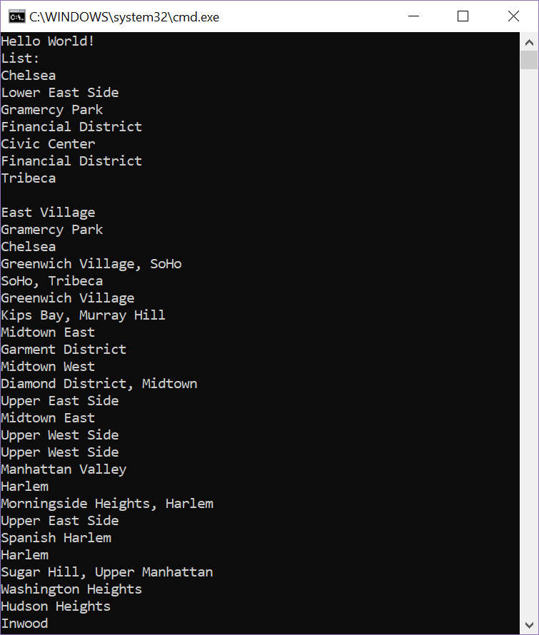
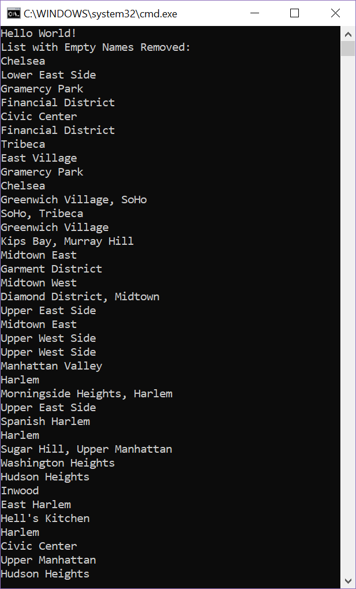
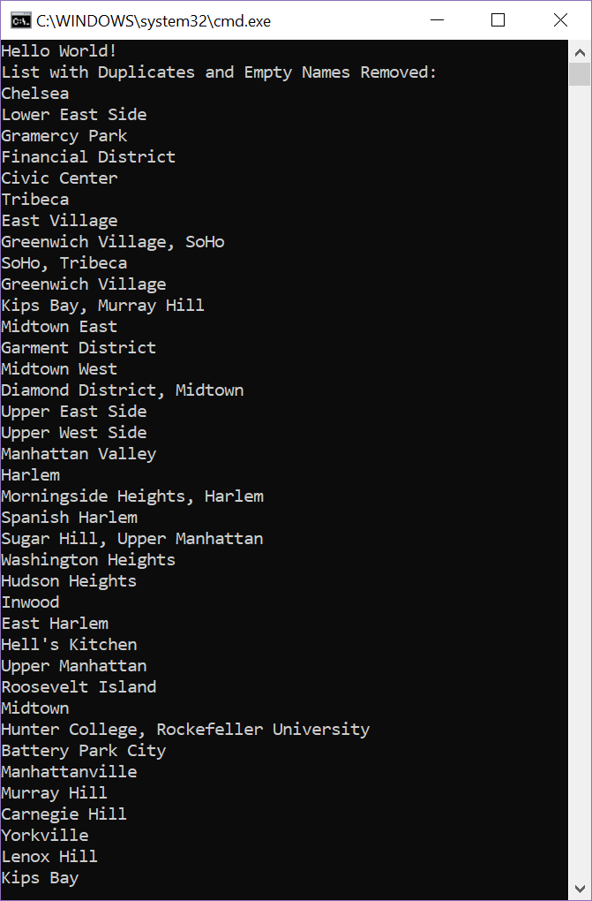
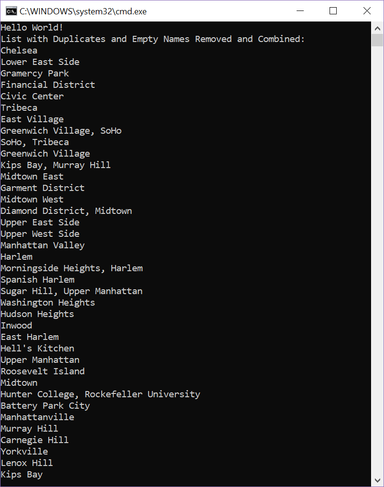
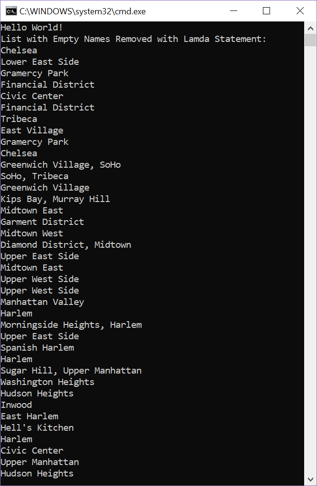

# Lab08-LINQinManhattan

## Description
Takes in a JSON file containing different neighborhoods of Manhattan. Using different methods, we parse the JSON data, create a list of Neighborhoods, and then filter the list of neighborhoods to remove duplicates and neighborhoods with no names.

## Instructions
- Create a JSON object (JObject) that contains all the lines of the JSON file
- Parse that JSON object. For each neighborhood in the json object, create a new Neighborhood object from the Neighborhood class, and set the properties of the object to the properties of the json neighborhood. Put each new neighborhood into a List.
- Filter the list using LINQ or Lamda statements.
- Print the list of neighborhoods using Console.WriteLine().

## Visual

